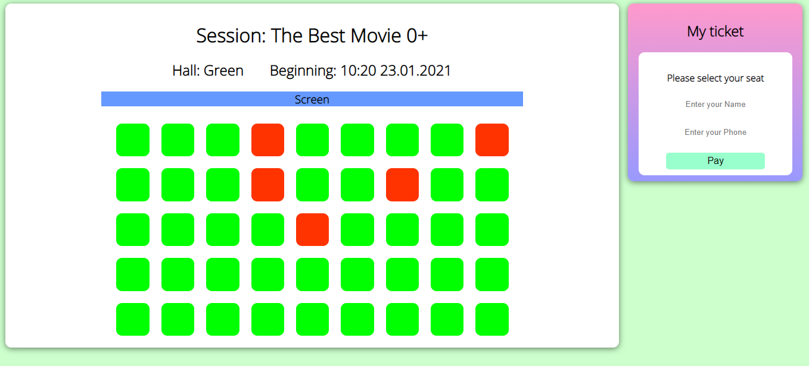
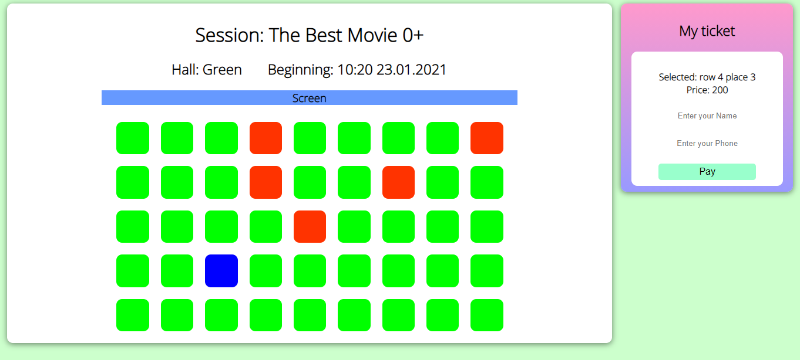
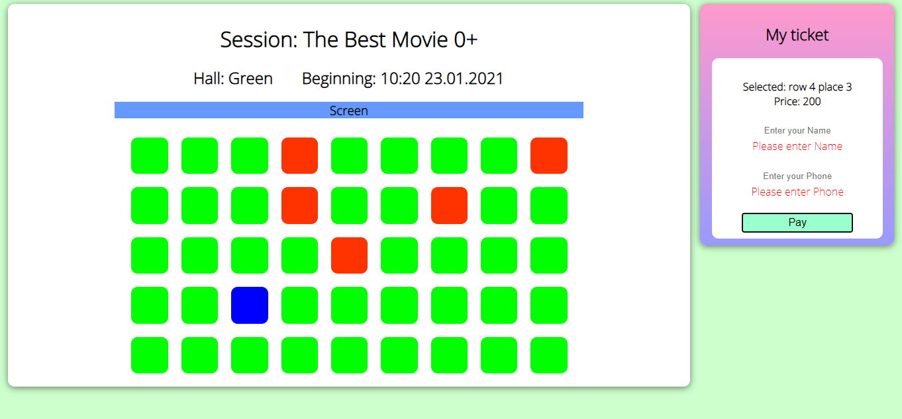
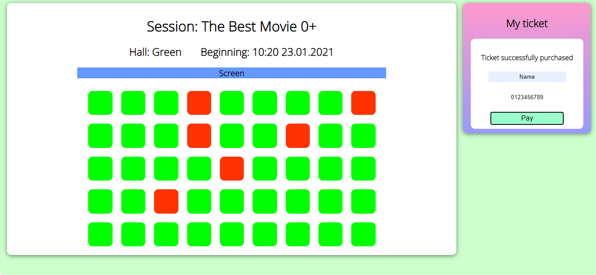

# job4j_cinema

Техническое задание: Простой веб-сайт по покупки билетов в кинотеатр с использованием Servlet

Краткое описание проекта:
- Проект представлен одной веб-страницей. Она поделена на два блока. 
- Первый блок отвечает за актуальную информацию о свободных и купленных местах. Связан с HallServlet.
- Второй блок отвечает за покупку выбранного места. Связан с PaymentServlet.
- Запросы на сервер отправлялись с помощью Fetch API. Без перезагрузки всей страницы.
- Данные хранятся в базе данных PostgreSQL.
- Структура базы данных в виде таблиц: Halls, SESSIONS и TICKETS.   
- Шаблон MVC
   
   

В данном проекте использовались:
- Java 11
- Servlet, JSP, JSTL.
- HTML, CSS, JavaScript, асинхронные запросы с помощью Fetch API.
- PostgreSQL, Liquibase - все данные хранились в БД. По мере необходимости извлекались и использовались.
- Apache Commons DBCP - Для запросов к БД использовался Thread Pool.
- JSON - Использовался для обмена данными.
- SLF4J, Logback - Ведение логов в проекте.
   
   

Начальная страница. Показаны свободные (зелёные) и купленные (красные) места:

  
Пользователь выбираем место кликом мышки, если оно куплено отобразится надпись с просьбой выбрать другое место. В случае клика по свободному месту, отобразится номер места и цена:

  
Валидация формы выполняется с помощью JavaScript:

  
Результат успешной покупки:

